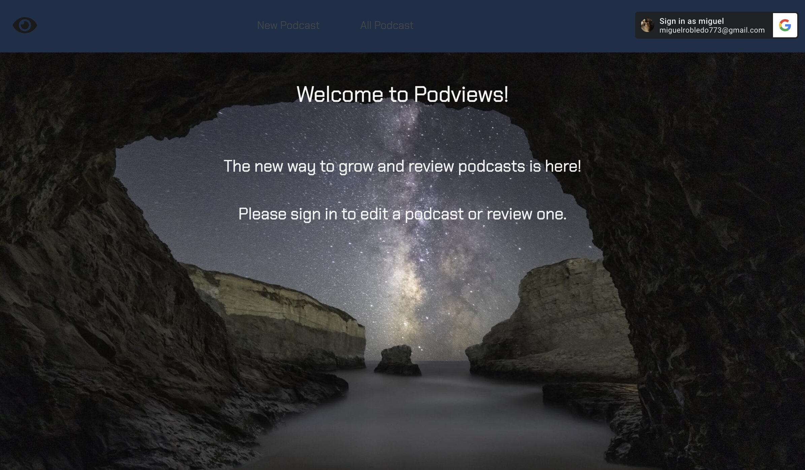
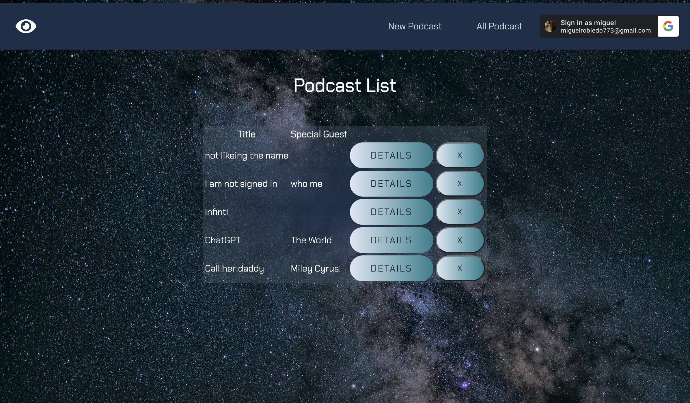
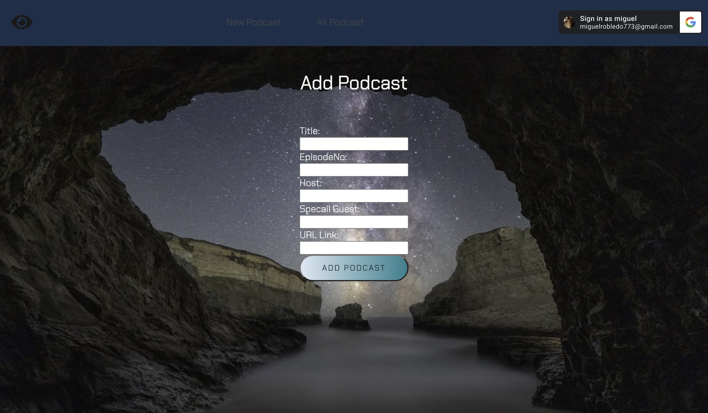

# Podviews

Game Objective: Between two player, take turns dropping tokens down board. A winner is deternined once a player connects four tokens either horizontally, vertically, or diagnally.

---

Link to website  : Click here -> [Podviews](https://podviews.fly.dev/)
-- 
## Technologies Used :atom: :
+ Javascript 
+ CSS 
+ HTML
+ Git
+ Github
+ Mongooge
+ Node.JS
+ Mongodb
---

## Contact :telephone: :

Miguel Robledo - miguelrobledo773@gmail.com

---

## Acknowledgments:
* [W3schools](https://www.w3schools.com)
* [CSS-Tricks/Flexbox](https://css-tricks.com/snippets/css/a-guide-to-flexbox/)
* [MDN Web Docs](https://developer.mozilla.org/en-US/)
* [Mixkit](https://mixkit.co/free-sound-effects/win/)
---

## IceBox
- [ ]Add the option to add a fifth circle to connect
- [ ] Add a dark and light mode buttons
- [x] Add an animation to hover each div
- [x] Add an animation when the winner is announced. 

